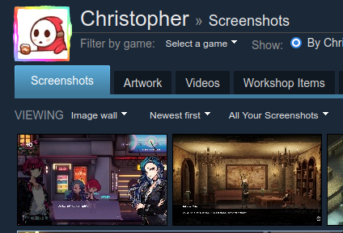

# Screenshot Bot

Screenshot Bot is a Discord bot that periodically checks specified Steam accounts or Twitter accounts for new image tweets, and posts them in a designated Discord channel.




## Features

- Monitor multiple Twitter accounts
- Monitor multiple Steam accounts
- Post new image tweets as messages in a Discord channel
- Automatically restarts in case of failure

## Requirements

- Python 3.8+
- Docker
- A Discord bot token
- Twitter account(s) to monitor

## Dependencies

- discord.py
- beautifulsoup4
- selenium
- requests

## Setup

1. Clone this repository.

2. Install the required dependencies:

pip install -r requirements.txt

3. Create a config-twitter.json and config-steam.json file in the project directory with the following structure:

config-twitter.json:
```json
{
  "discord_token": "your_discord_bot_token",
  "channel_id": your_channel_id,
  "users": [
    {
      "twitter_username": "example_twitter_username",
      "discord_user_id": your_discord_user_id
    }
  ]
}
```

config-steam.json:
```json
{
    "users": [
        {
            "steam_username": "raylinth",
            "discord_user_id": 11111111111111111
        },
        {
            "steam_username": "Zzzzzzz",
            "discord_user_id": 22222222222222222
        }
    ],
    "discord_token": "",
    "channel_id": 333,
    "guild_id": 444
}
```

Replace your_discord_bot_token, your_channel_id, example_twitter_username, and your_discord_user_id with the appropriate values.

4. Build the Docker image:

```
docker build -t screenshot-bot .
```

5. Run the Docker container:

```
docker run -d -t screenshot-bot --restart=always screenshot-bot:latest
```

## Usage

Once the bot is running, it will periodically check the specified Twitter accounts for new image tweets and post them in the designated Discord channel.

You can stop the bot by stopping the Docker container:

```
docker stop <container_id>
```

Replace <container_id> with the ID of the running container. You can find the container ID by running:

```
docker ps
```